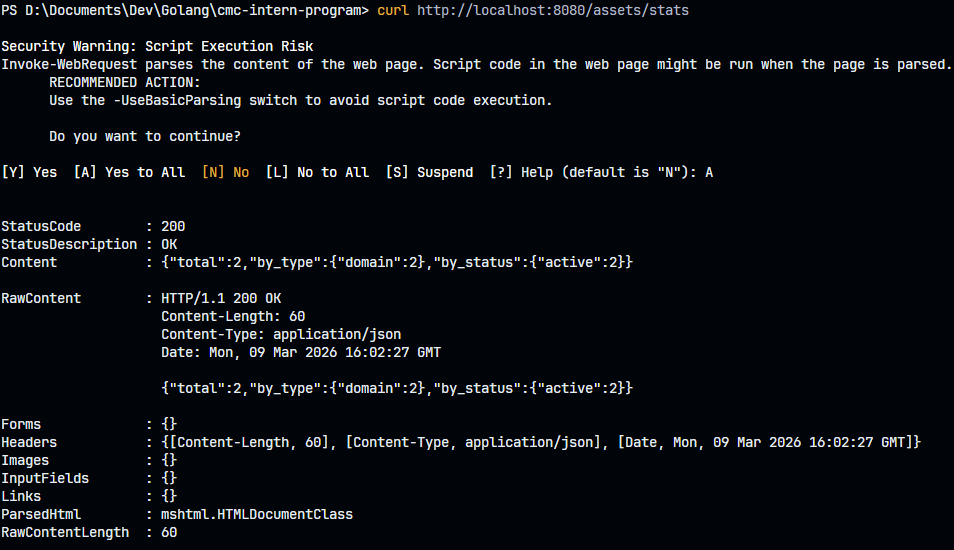
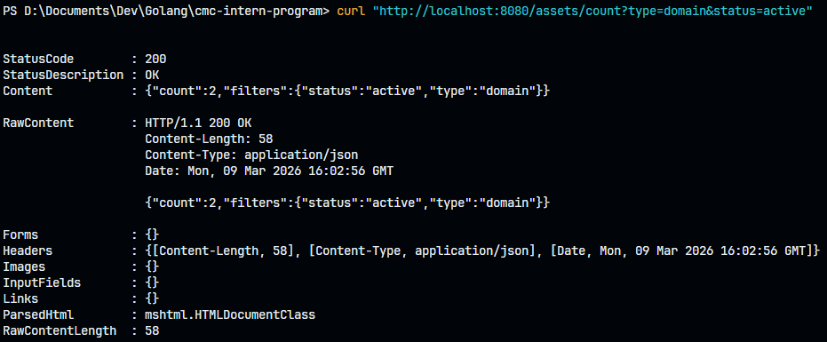
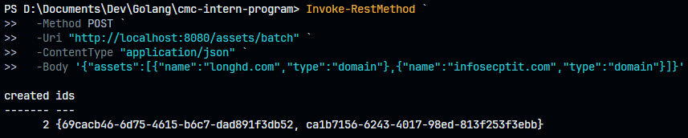
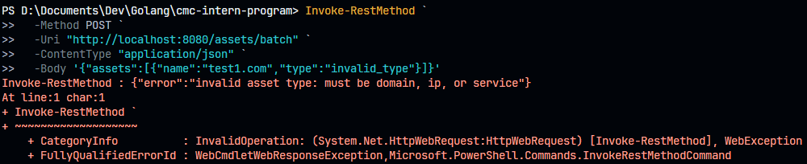
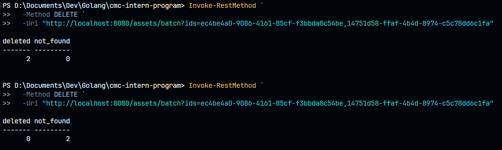
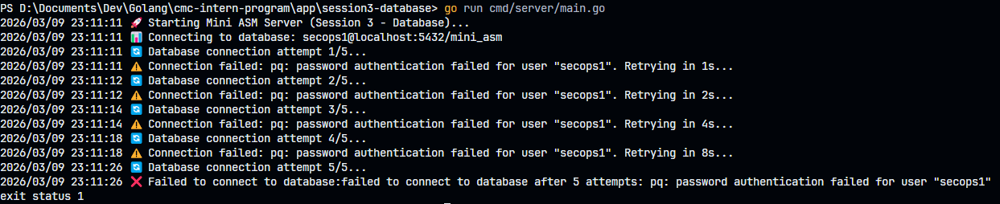
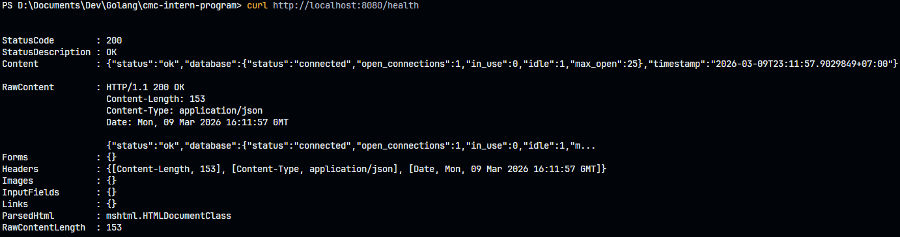
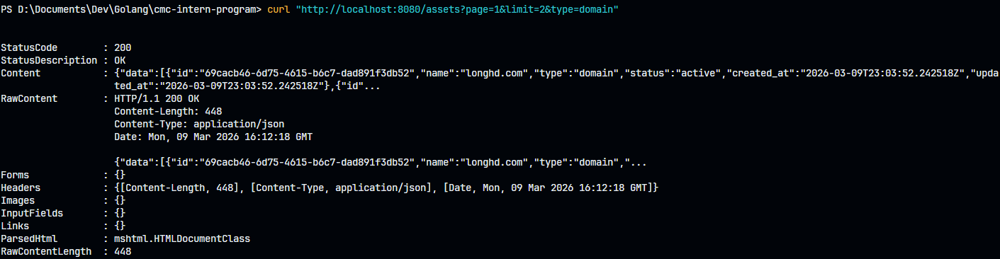
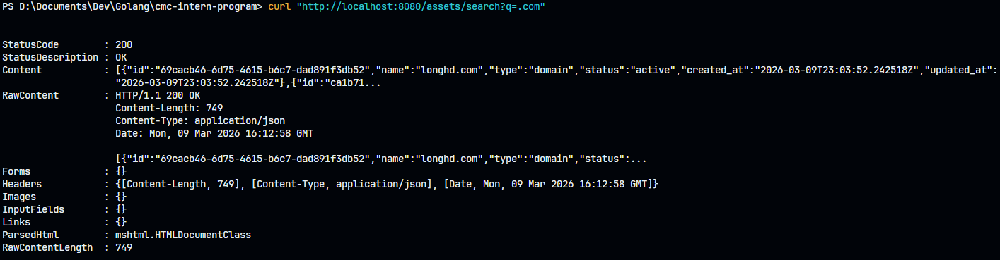

# Homework Submission

**Họ tên:** Hà Duy Long

## Các bài đã hoàn thành

- [x] Bài 1: Statistics APIs
- [x] Bài 2: Batch Create
- [x] Bài 3: Batch Delete
- [x] Bài 4: Connection Retry
- [x] Bài 5: Health Check
- [x] Bài 6: Pagination (Bonus)
- [x] Bài 7: Search (Bonus)

---

## Chi tiết triển khai

### Bài 1: Statistics APIs

**`GET /assets/stats`** – trả về thống kê tổng quan:
```bash
curl http://localhost:8080/assets/stats
```


**`GET /assets/count`** – đếm có filter tùy chọn:
```bash
curl "http://localhost:8080/assets/count?type=domain&status=active"
```


**Files thay đổi:**
- `internal/model/asset.go` – thêm struct `Stats`, `PagedResult`, `Pagination`
- `internal/storage/storage.go` – thêm method `GetStats()`, `Count()`
- `internal/storage/postgres/postgres.go` – implement `GetStats()`, `Count()`
- `internal/storage/memory/memory.go` – implement `GetStats()`, `Count()`
- `internal/service/asset_service.go` – thêm `GetStats()`, `CountAssets()`
- `internal/handler/asset_handler.go` – thêm `GetStats()`, `CountAssets()` handlers
- `cmd/server/main.go` – đăng ký routes

---

### Bài 2: Batch Create Assets

**`POST /assets/batch`** – tạo nhiều assets trong 1 transaction:
```bash
Invoke-RestMethod `
  -Method POST `
  -Uri "http://localhost:8080/assets/batch" `
  -ContentType "application/json" `
  -Body '{"assets":[{"name":"test1.com","type":"domain"},{"name":"test2.com","type":"domain"}]}'
```


Invalid type → 400, nothing created
```
curl -X POST http://localhost:8080/assets/batch \
  -H "Content-Type: application/json" \
  -d '{"assets":[{"name":"ok.com","type":"domain"},{"name":"bad","type":"invalid_type"}]}'
```


**Kỹ thuật:**
- Validate tất cả assets trước khi insert
- PostgresStorage dùng `db.Begin()` / `tx.Commit()` / `defer tx.Rollback()`
- Limit tối đa 100 assets/request (trả về `ErrTooManyAssets` nếu vượt)

**Files thay đổi:**
- `internal/model/errors.go` – thêm `ErrTooManyAssets`
- `internal/storage/storage.go` – thêm `BatchCreate()`
- `internal/storage/postgres/postgres.go` – implement với transaction
- `internal/storage/memory/memory.go` – implement all-or-nothing
- `internal/service/asset_service.go` – thêm `BatchCreateAssets()`, `CreateAssetInput`
- `internal/handler/asset_handler.go` – thêm `BatchCreate()` handler

---

### Bài 3: Batch Delete Assets

**`DELETE /assets/batch?ids=uuid1,uuid2,...`** – xóa nhiều assets:
```bash
Invoke-RestMethod `
  -Method DELETE `
  -Uri "http://localhost:8080/assets/batch?ids=ec4be4a0-9086-4161-85cf-f3bbda8c54be,14751d58-ffaf-4b4d-8974-c5c78dd6c1fa"
```


**Behavior:**
- Xóa tất cả IDs hợp lệ
- Bỏ qua IDs không tồn tại (trả về `not_found` count)

**Files thay đổi:**
- `internal/storage/storage.go` – thêm `BatchDelete()`
- `internal/storage/postgres/postgres.go` – implement
- `internal/storage/memory/memory.go` – implement
- `internal/service/asset_service.go` – thêm `BatchDeleteAssets()`
- `internal/handler/asset_handler.go` – thêm `BatchDelete()` handler

---

### Bài 4: Database Connection Retry

**File mới:** `internal/database/retry.go`

Hàm `ConnectWithRetry(dsn string, maxRetries int) (*sql.DB, error)` với exponential backoff:

```
🔄 Database connection attempt 1/5...
⚠️  Connection failed: connection refused. Retrying in 1s...
🔄 Database connection attempt 2/5...
⚠️  Connection failed: connection refused. Retrying in 2s...
🔄 Database connection attempt 3/5...
✅ Database connected successfully!
```


Backoff: `time.Duration(1<<uint(attempt-1)) * time.Second` → 1s, 2s, 4s, 8s, 16s

**Files thay đổi:**
- `internal/database/retry.go` – file mới
- `cmd/server/main.go` – dùng `database.ConnectWithRetry(connStr, 5)`

---

### Bài 5: Database Health Check

**`GET /health`** – trả về DB connection pool info:
```bash
curl http://localhost:8080/health
```


**Files thay đổi:**
- `internal/handler/health_handler.go` – `NewHealthHandler(*sql.DB)`, dùng `db.Ping()` và `db.Stats()`
- `cmd/server/main.go` – pass `db` vào `handler.NewHealthHandler(db)`

---

### Bài 6: Pagination & Filtering (Bonus)

**`GET /assets?page=1&limit=10&type=domain&status=active`**:
```bash
curl "http://localhost:8080/assets?page=1&limit=2&type=domain"
```


**Files thay đổi:**
- `internal/storage/storage.go` – thêm `ListPaginated()`
- `internal/storage/postgres/postgres.go` – implement với LIMIT/OFFSET
- `internal/storage/memory/memory.go` – implement với slice
- `internal/service/asset_service.go` – thêm `ListAssetsPaginated()`
- `internal/handler/asset_handler.go` – cập nhật `ListAssets()` để detect pagination params

---

### Bài 7: Search by Name (Bonus)

**`GET /assets/search?q=example`** – tìm kiếm partial, case-insensitive:
```bash
curl "http://localhost:8080/assets/search?q=.com"
```


**Files thay đổi:**
- `internal/handler/asset_handler.go` – thêm `SearchAssets()` handler
- `cmd/server/main.go` – đăng ký route `GET /assets/search`
